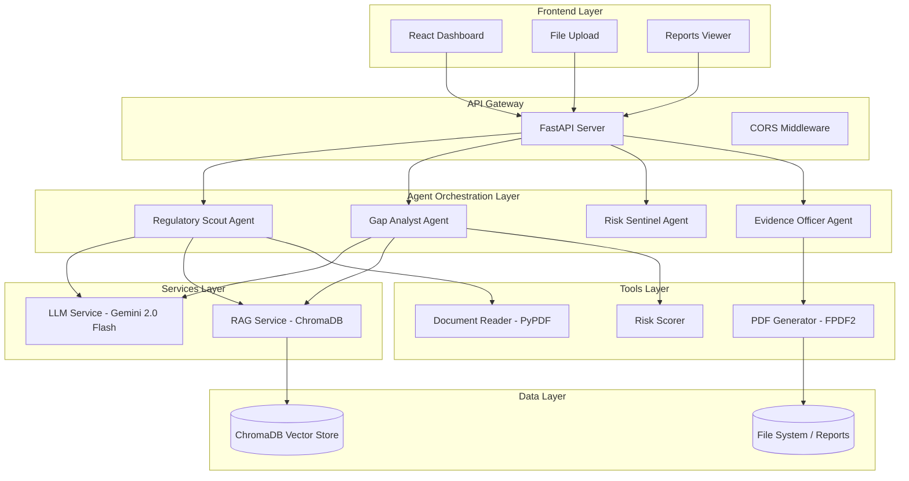

# 🛡️ Autonomous AI Compliance Platform

<div align="center">


**An agentic, LLM-powered compliance automation platform built for financial services organizations.**  
Automate regulatory gap analysis, policy auditing, real-time risk monitoring, and audit report generation — all orchestrated by a team of specialized AI agents.

</div>

---

## 📌 Overview

The **Autonomous AI Compliance Platform** replaces traditional, manual compliance workflows with an intelligent multi-agent system. It ingests regulatory documents (PCI-DSS, GDPR, etc.), compares them against internal policies using **Retrieval-Augmented Generation (RAG)**, surfaces compliance gaps with risk scores, and generates industry-grade PDF audit reports — all with minimal human intervention.

### Why This Platform?

| Traditional Compliance | This Platform |
|------------------------|--------------|
| Manual document review | AI-powered automated ingestion |
| Days to weeks per audit | Scan in minutes |
| Static, point-in-time reports | Real-time risk monitoring |
| Human error in gap analysis | LLM-driven reasoning with RAG context |
| Generic templates | Client-specific PDF audit packages |

---

## ✨ Features

### 🤖 Multi-Agent Architecture (ReAct Pattern)
Four specialized AI agents collaborate using the **Reason + Act** paradigm:

| Agent | Role | Tools Used |
|-------|------|------------|
| **Regulatory Scout** | Parses and indexes regulatory documents | Document Reader, RAG Indexer |
| **Gap Analyst** | Detects compliance gaps, scores risks | LLM Reasoning, Risk Scorer |
| **Risk Sentinel** | Monitors live transaction streams for violations | Rule-based Engine |
| **Evidence Officer** | Compiles and generates PDF audit reports | PDF Generator |

### 🧠 AI & Knowledge Features
- **RAG Pipeline**: Documents are embedded and stored in **ChromaDB** for semantic retrieval during analysis
- **Gemini 2.0 Flash**: Powers all LLM reasoning — obligation extraction, gap detection, and auto-remediation suggestions
- **Structured Extraction**: LLM extracts regulatory obligations from raw text into structured schemas
- **Auto-Remediation**: Analyst agent optionally generates fix recommendations inline with each finding

### 📊 Dashboard & Reporting
- Real-time **Compliance Score** with trend tracking
- **Risk Heatmap** across regulatory domains
- **Live Agent Activity Log** with timestamped actions per client/document
- **PCI-DSS 4.0 Checklist** embedded in generated PDF reports
- One-click **PDF download** of full audit packages

### 🗂️ Document Management
- **Multi-file upload** — ingest PDFs and TXT files in batch
- **Regulations page** — manage your indexed knowledge base
- **Reports page** — list and download all generated audit reports

### ⚙️ Configurable Agent Settings
- Toggle **auto-remediation** per agent
- Adjust **risk thresholds** and monitoring parameters
- Live **Gemini API status** indicator
- All settings persisted via API

---

## 🏗️ Architecture



### Data Flow — Compliance Scan

```
Upload Documents → Scout Agent → ChromaDB (indexed)
                                      ↓
Trigger Scan → Analyst Agent → RAG Query → LLM Gap Detection → Risk Score
                                      ↓
           Evidence Officer → PDF Report Generation → Download
```

---

## 🗂️ Project Structure

```
autonomous-ai-compliance-platform/
│
├── client/                         # React 19 + Vite Frontend
│   ├── src/
│   │   ├── pages/
│   │   │   ├── Dashboard.jsx       # Main compliance dashboard
│   │   │   ├── Regulations.jsx     # Document upload & management
│   │   │   ├── Reports.jsx         # Download audit PDF reports
│   │   │   ├── RiskAnalysis.jsx    # Risk heatmap & analysis
│   │   │   ├── ActivityLog.jsx     # Agent activity timeline
│   │   │   ├── Settings.jsx        # Agent configuration
│   │   │   └── Login.jsx           # Authentication screen
│   │   ├── components/             # Reusable UI components
│   │   ├── lib/                    # API utilities & helpers
│   │   └── main.jsx
│   ├── Dockerfile
│   ├── nginx.conf
│   └── package.json
│
├── server/                         # FastAPI Python Backend
│   ├── agents/
│   │   ├── base.py                 # BaseAgent class (ReAct loop)
│   │   ├── scout.py                # Regulatory Scout Agent
│   │   ├── analyst.py              # Gap Analyst Agent
│   │   ├── sentinel.py             # Risk Sentinel Agent
│   │   └── evidence.py             # Evidence Officer Agent
│   ├── services/
│   │   ├── llm.py                  # Gemini LLM service wrapper
│   │   └── rag_service.py          # ChromaDB RAG service
│   ├── tools/                      # PDF generator, doc reader, etc.
│   ├── main.py                     # FastAPI app & all endpoints
│   ├── models.py                   # Pydantic data models
│   ├── database.py                 # SQLAlchemy setup
│   ├── requirements.txt
│   └── Dockerfile
│
├── docs/
│   └── architecture.md             # Full technical architecture doc
│
└── docker-compose.yml              # Full-stack deployment
```

---

## 🚀 Quick Start

### Prerequisites

| Requirement | Version |
|-------------|---------|
| Python | 3.10+ |
| Node.js | 18+ |
| Gemini API Key | [Get one free →](https://aistudio.google.com) |
| Docker (optional) | 20+ |

---

### Option A: Local Development

#### 1. Clone the Repository

```bash
git clone https://github.com/your-username/autonomous-ai-compliance-platform.git
cd autonomous-ai-compliance-platform
```

#### 2. Setup the Backend

```bash
cd server

# Create a virtual environment (recommended)
python -m venv venv
.\venv\Scripts\activate        # Windows
# source venv/bin/activate     # Linux / macOS

# Install Python dependencies
pip install -r requirements.txt
```

#### 3. Configure Environment Variables

Create a `.env` file in the `server/` directory:

```env
GEMINI_API_KEY=your_gemini_api_key_here
DATABASE_URL=sqlite:///./compliance.db      # or PostgreSQL URL
```

> **Tip:** Get your free Gemini API key at [https://aistudio.google.com](https://aistudio.google.com)

#### 4. Start the Backend Server

```bash
cd server
uvicorn main:app --reload
```

Backend runs at: **http://localhost:8000**  
API docs (Swagger): **http://localhost:8000/docs**

#### 5. Setup & Start the Frontend

Open a new terminal:

```bash
cd client
npm install
npm run dev
```

Frontend runs at: **http://localhost:5173**

---

### Option B: Docker Compose (Recommended for Production)

Spin up the entire stack — backend, frontend, PostgreSQL, ChromaDB, Redis, and n8n — with a single command:

```bash
# Set your Gemini API key
export GEMINI_API_KEY=your_key_here   # Linux/macOS
$env:GEMINI_API_KEY="your_key_here"   # Windows PowerShell

# Start all services
docker-compose up --build
```

| Service | URL |
|---------|-----|
| Frontend (React) | http://localhost:3000 |
| Backend (FastAPI) | http://localhost:8000 |
| ChromaDB | http://localhost:8001 |
| n8n Automation | http://localhost:5678 |
| PostgreSQL | localhost:5432 |
| Redis | localhost:6379 |

---

## 🖥️ Using the Platform

1. **Login** — Open the app and sign in (demo accepts any credentials)
2. **Check Status** → Go to **Settings** to verify Gemini API is connected
3. **Upload Documents** → Go to **Regulations** → Upload one or more PDF/TXT policy files
4. **Run a Compliance Scan** → Click **Trigger Scan** on the Dashboard
5. **Monitor Progress** → Watch the **Agent Activity Log** update in real time
6. **Review Findings** → Explore the **Risk Analysis** page for gap details
7. **Download Report** → Go to **Reports** → Download your PDF audit package

---

## 📡 API Reference

| Endpoint | Method | Agent | Description |
|----------|--------|-------|-------------|
| `/api/dashboard` | GET | — | Dashboard metrics & compliance score |
| `/api/agents/ingest` | POST | Scout | Upload & index regulatory documents |
| `/api/agents/scan` | POST | Scout + Analyst | Trigger full compliance scan |
| `/api/agents/analyze` | POST | Analyst | Analyze a specific policy text |
| `/api/agents/monitor` | POST | Sentinel | Check transactions for violations |
| `/api/agents/report` | POST | Officer | Generate a PDF audit report |
| `/api/agents/activity` | GET | All | Fetch aggregated agent activity logs |
| `/api/reports` | GET | — | List all generated reports |
| `/api/reports/download/{filename}` | GET | — | Download a specific PDF report |
| `/api/status` | GET | — | Check Gemini API connectivity |
| `/api/settings` | GET/POST | — | Read/update agent configuration |

Full interactive API docs available at `http://localhost:8000/docs` (Swagger UI).

---

## 🧩 Technology Stack

| Layer | Technology | Purpose |
|-------|-----------|---------|
| **Frontend** | React 19 + Vite | Dashboard UI |
| **Styling** | TailwindCSS 3 + Framer Motion | Glassmorphism UI & animations |
| **Charts** | Recharts | Risk and compliance charts |
| **Backend** | FastAPI + Uvicorn | REST API & agent orchestration |
| **LLM** | Google Gemini 2.0 Flash | AI reasoning & text generation |
| **Vector DB** | ChromaDB | RAG semantic search |
| **Relational DB** | SQLite (dev) / PostgreSQL (prod) | Compliance data persistence |
| **PDF Generation** | FPDF2 | Audit report creation |
| **PDF Parsing** | PyPDF | Document ingestion |
| **Cache** | Redis | API response caching |
| **Workflow** | n8n | Automation pipelines |
| **Container** | Docker + Docker Compose | Deployment |

---

## 📋 Generated PDF Report Structure

Each audit report contains:

1. **Cover Page** — Client name, assessment date, compliance score, posture rating
2. **Executive Summary** — Requirements assessed, requirements met, gaps identified, critical issues
3. **PCI-DSS 4.0 Checklist** — All 14 requirements with PASS/FAIL status
4. **Detailed Findings** — Per-finding severity, description, and remediation steps
5. **Recommendations** — Prioritized action items with suggested timelines

---

## 🛠️ Troubleshooting

**Gemini API not connected?**
- Verify `GEMINI_API_KEY` is set in `server/.env`
- Restart the server: `uvicorn main:app --reload`
- Check the Settings page for live status

**ChromaDB errors on first run?**
- ChromaDB will auto-initialize its local DB on first document upload
- Ensure the `server/chroma_db/` directory is writable

**PDF not downloading?**
- Verify the `server/reports/` directory exists and has write permissions
- Check the FastAPI logs for `PDFGenerator` errors

**Multi-file upload not working?**
- Ensure `python-multipart` is installed (`pip install python-multipart`)
- Confirm you're on the latest frontend code and the server has been restarted

---

## 🤝 Contributing

Contributions are welcome! Please:

1. Fork the repository
2. Create a feature branch (`git checkout -b feature/your-feature`)
3. Commit your changes (`git commit -m 'Add: your feature description'`)
4. Push to the branch (`git push origin feature/your-feature`)
5. Open a Pull Request

---

## 📄 License

This project is licensed under the **MIT License** — see the [LICENSE](LICENSE) file for details.

---

## 👤 Author

Built with ❤️ for the financial compliance industry.  
Powered by [Google Gemini](https://deepmind.google/technologies/gemini/) · [FastAPI](https://fastapi.tiangolo.com/) · [ChromaDB](https://www.trychroma.com/) · [React](https://react.dev/)