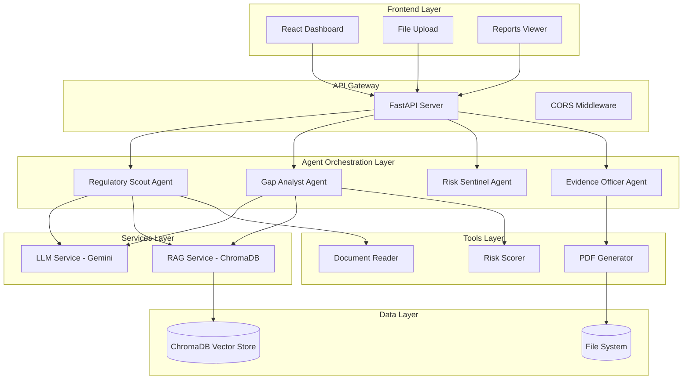

# Agentic AI Compliance Platform - Architecture Document

## Executive Summary

This document describes the **agentic architecture** of the Autonomous AI Compliance Platform. The system uses a **multi-agent design pattern** with specialized AI agents that collaborate to automate compliance workflows for financial services.

---

## High-Level Architecture



---

## Agent Architecture

### Design Pattern: ReAct (Reason + Act)

Each agent follows the **ReAct paradigm**:

```
             ┌─────────────────────────────────────────┐
             │           AGENT LIFECYCLE               │
             └─────────────────────────────────────────┘
                              │
                    ┌─────────▼─────────┐
                    │   RECEIVE TASK    │
                    │  (API Endpoint)   │
                    └─────────┬─────────┘
                              │
                    ┌─────────▼─────────┐
                    │   SET CONTEXT     │
                    │  (Client Name)    │
                    └─────────┬─────────┘
                              │
               ┌──────────────▼──────────────┐
               │          THINK              │
               │  • Query RAG for context    │
               │  • Call LLM for reasoning   │
               │  • Formulate action plan    │
               └──────────────┬──────────────┘
                              │
               ┌──────────────▼──────────────┐
               │           ACT               │
               │  • Execute tools            │
               │  • Generate outputs         │
               │  • Log activity             │
               └──────────────┬──────────────┘
                              │
               ┌──────────────▼──────────────┐
               │      RETURN RESULT          │
               │  (JSON Response + Logs)     │
               └─────────────────────────────┘
```

---

## Agent Specifications

### 1. Regulatory Scout Agent

| Attribute | Value |
|-----------|-------|
| **Role** | Regulatory Scanning |
| **Tools** | DocumentReader |
| **Input** | Document files (PDF/TXT) or feed URLs |
| **Output** | Extracted obligations indexed in RAG |

```python
# Simplified Flow
async def process_regulation(text, filename):
    # 1. Set client context for logging
    self.set_current_client(filename)
    
    # 2. THINK: Use LLM to extract obligations
    obligations = await llm.extract_structured(text, schema)
    
    # 3. ACT: Index into RAG
    await rag.add_document(text, metadata)
    
    return obligations
```

---

### 2. Gap Analyst Agent

| Attribute | Value |
|-----------|-------|
| **Role** | Compliance Analysis |
| **Tools** | RiskScorer |
| **Input** | Policy text + Client name |
| **Output** | Gap findings with risk scores |

```python
# Simplified Flow
async def analyze_policy(policy_text):
    # 1. THINK: Retrieve regulations from RAG
    regulations = await rag.query(policy_text)
    
    # 2. THINK: Use LLM to detect gaps
    finding = await llm.complete(
        f"Compare policy: {policy_text} against: {regulations}"
    )
    
    # 3. ACT: Score risk
    risk_matrix = scorer.calculate_score(finding)
    
    # 4. ACT (if enabled): Auto-remediate
    if self.auto_remediation_enabled:
        fix = await llm.complete(f"Generate fix for: {finding}")
        return {"finding": finding, "remediation": fix}
    
    return {"finding": finding, "status": "Pending Review"}
```

---

### 3. Risk Sentinel Agent

| Attribute | Value |
|-----------|-------|
| **Role** | Real-time Monitoring |
| **Tools** | None (rule-based) |
| **Input** | Transaction/data stream |
| **Output** | Risk alerts |

```python
# Simplified Flow
async def monitor_stream(transactions):
    alerts = []
    for tx in transactions:
        # Rule-based checks
        if tx["amount"] > 10000:
            alerts.append({"type": "HIGH_VALUE", "tx": tx})
        if tx["contains_pii"]:
            alerts.append({"type": "PII_DETECTED", "tx": tx})
    return alerts
```

---

### 4. Evidence Officer Agent

| Attribute | Value |
|-----------|-------|
| **Role** | Audit & Reporting |
| **Tools** | PDFGenerator |
| **Input** | Findings + Client name |
| **Output** | PDF report file |

```python
# Simplified Flow
async def generate_package(findings, client_name):
    # 1. THINK: Summarize findings
    summary = f"Report for {client_name}: {len(findings)} findings"
    
    # 2. ACT: Generate PDF
    filename = pdf_tool.generate_report(findings, client_name)
    
    return {"report_url": f"/api/reports/download/{filename}"}
```

---

## Data Flow Diagrams

### Document Ingestion Flow

```
┌──────────┐    ┌─────────────┐    ┌────────────────┐    ┌──────────────┐
│  Upload  │───▶│ Doc Reader  │───▶│ Scout Agent    │───▶│  ChromaDB    │
│  (PDF)   │    │ (Extract)   │    │ (LLM Extract)  │    │  (Index)     │
└──────────┘    └─────────────┘    └────────────────┘    └──────────────┘
     │                                      │
     │                                      ▼
     │                              ┌───────────────┐
     └─────────────────────────────▶│ Activity Log  │
                                    └───────────────┘
```

### Compliance Scan Flow

```
┌──────────────┐
│ Trigger Scan │
└──────┬───────┘
       │
       ▼
┌──────────────────────────────────────────────────────────────────┐
│                        PARALLEL EXECUTION                         │
├──────────────────────┬───────────────────────────────────────────┤
│   Scout Agent        │         Analyst Agent                     │
│   - Scan feeds       │         - Query RAG                       │
│   - Log activity     │         - LLM gap detection               │
│                      │         - Risk scoring                    │
│                      │         - Auto-remediation (if enabled)   │
└──────────────────────┴───────────────────────────────────────────┘
       │
       ▼
┌──────────────────────┐
│   Return Results     │
│   - Scout logs       │
│   - Analyst findings │
└──────────────────────┘
```

---

## Service Layer

### LLM Service (Gemini)

```python
class LLMService:
    model: GenerativeModel  # gemini-2.0-flash
    
    async def complete(prompt: str) -> str:
        """Generate text completion"""
        response = await model.generate_content_async(prompt)
        return response.text
    
    async def extract_structured(text: str, schema: dict) -> dict:
        """Extract structured data per schema"""
        prompt = f"Extract {schema} from: {text}"
        return json.loads(await self.complete(prompt))
```

### RAG Service (ChromaDB)

```python
class RAGService:
    collection: chromadb.Collection
    
    async def add_document(content: str, metadata: dict):
        """Index document with embeddings"""
        embedding = generate_embedding(content)  # Gemini embedding
        collection.add(
            documents=[content],
            embeddings=[embedding],
            metadatas=[metadata]
        )
    
    async def query(query_text: str, top_k: int = 3) -> List[dict]:
        """Semantic search in knowledge base"""
        results = collection.query(query_texts=[query_text], n_results=top_k)
        return results
```

---

## Activity Logging System

### Log Entry Structure

```python
class ActivityLogEntry:
    timestamp: datetime      # When action occurred
    action: str             # What happened
    agent_name: str         # Which agent
    agent_role: str         # Agent's role
    client: str | None      # Client/document context
    
    def to_dict(self) -> dict:
        return {
            "timestamp": self.timestamp.isoformat(),
            "time_display": "HH:MM:SS",
            "action": self.action,
            "agent": self.agent_name,
            "client": self.client
        }
```

### Log Display Format

```
[15:30:45] [Compliance Analysis] [AegisPay_Policy] Cross-referencing against 3 regulations...
[15:30:47] [Compliance Analysis] [AegisPay_Policy] Gap Detection Complete: Encryption missing
[15:30:48] [Compliance Analysis] [AegisPay_Policy] Risk Scored: Critical (Impact: High)
```

---

## PDF Report Structure

```
┌─────────────────────────────────────────────────────────────┐
│                      COVER PAGE                              │
│  ┌─────────────────────────────────────────────────────────┐│
│  │  COMPLIANCE AUDIT REPORT                                ││
│  │  PCI-DSS 4.0 Assessment                                 ││
│  │  Client: AegisPay Financial Services                    ││
│  │  Score: 72%                                             ││
│  │  Posture: NEEDS IMPROVEMENT                             ││
│  └─────────────────────────────────────────────────────────┘│
├─────────────────────────────────────────────────────────────┤
│                   EXECUTIVE SUMMARY                          │
│  • Requirements Assessed: 14                                 │
│  • Requirements Met: 10                                      │
│  • Gaps Identified: 4                                        │
│  • Critical Issues: 1                                        │
├─────────────────────────────────────────────────────────────┤
│                PCI-DSS 4.0 CHECKLIST                         │
│  ┌────┬──────────────────────────────────────────┬────────┐ │
│  │ ID │ Requirement                              │ Status │ │
│  ├────┼──────────────────────────────────────────┼────────┤ │
│  │1.1 │ Network security controls                │ ✓ PASS │ │
│  │3.1 │ Encrypt stored account data              │ ✗ FAIL │ │
│  │... │ ...                                      │ ...    │ │
│  └────┴──────────────────────────────────────────┴────────┘ │
├─────────────────────────────────────────────────────────────┤
│                   DETAILED FINDINGS                          │
│  Finding #1: Encryption Gap                                  │
│  Severity: Critical                                          │
│  Description: Derived data stored unencrypted                │
│  Remediation: Implement AES-256 encryption                   │
├─────────────────────────────────────────────────────────────┤
│                   RECOMMENDATIONS                            │
│  1. Prioritize encryption implementation                     │
│  2. Schedule follow-up in 30 days                           │
└─────────────────────────────────────────────────────────────┘
```

---

## API Endpoints Summary

| Endpoint | Method | Agent/Service | Description |
|----------|--------|---------------|-------------|
| `/api/agents/ingest` | POST | Scout | Multi-file upload |
| `/api/agents/scan` | POST | Scout + Analyst | Full compliance scan |
| `/api/agents/analyze` | POST | Analyst | Analyze policy text |
| `/api/agents/monitor` | POST | Sentinel | Check transactions |
| `/api/agents/report` | POST | Officer | Generate PDF |
| `/api/agents/activity` | GET | All | Aggregated logs |
| `/api/status` | GET | LLM Service | Check Gemini connection |
| `/api/settings` | GET/POST | Config | Agent toggles |

---

## Technology Stack

| Layer | Technology | Purpose |
|-------|------------|---------|
| Frontend | React 19 + Vite | UI Dashboard |
| API | FastAPI | REST endpoints |
| LLM | Gemini 2.0 Flash | AI reasoning |
| Vector DB | ChromaDB | Semantic search |
| PDF | FPDF2 | Report generation |
| State | localStorage + API | Settings persistence |
